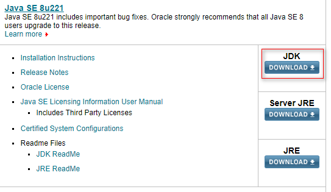

# Java环境搭建

`Java`环境搭建分为三步：

- 下载JDK
- 安装JDK
- 环境变量配置

下面将详细介绍安装的步骤。

## 下载JDK

首先进入**www.oracle.com**进行下载

点击`Downloads`

点击`Java`

选择`Java(JDK) for Developers`

这是`JDK 12`，是最新版的，目前主流的是`JDK 8`，我们往下翻

点击`JDK DOWNLOAD`

选择合适自己机器的版本下载，一般现在的机器都是`64`为，选择下载即可，但我们点击下载时，它要我们登录

这里提供一个账号

- 用户名：2696671285@qq.com
- 密码：Oracle123

登录成功后就开始下载了

## 安装JDK

安装`JDK`就是一直点`next`即可，因为`JDK`是包含`JRE`的，所以`JRE`可以不必安装。这里需要注意的是，不要将安装目录安装在中文目录下，因为可能会碰到各种各样的问题，我们将它扼杀在摇篮里即可。这里需要记住安装的路径，比如我安装的路径是

- `G:\java`

安装好以后里面是这样的

## 环境变量配置

现在要进行环境变量的配置，可能不好不知道为什么需要进行配置，首先你在命令行输入一个命令，比如`notepad`(它会打开一个记事本)，但是当你输入一串乱七八糟的字符时，它会提示你

那命令行怎么知道`notepad`是一个命令，而你乱输入的字符不是命令呢? 因为当你输入字符后，命令行会去一个路径找是否有这个命令，如果有进行执行程序，没有进行向上面那样。这个路径就是我们要去配置的东西，我们要把与`Java`相关的命令添加到命令行要搜索的路径中，这样命令行就可以识别这是一个命令。那么与`Java`有关的命令放在哪里，首先打开你安装的那个目录

然后进入`bin`文件夹，这个文件夹里面就是有关`Java`的各种命令

比如我的路径为

- `G:\java\bin`

现在来到桌面，右键我的电脑，点击属性

然后按照以下步骤

会进入下面这个界面

点击新建，将你刚刚复制的路径粘贴上去

现在大功告成了。为了检验是否配置成功，我们打开命令行，输入`java`和`javac`命令，如果出现下面的界面就说明成功了

如果提示命令找不到之类的，说明配置失败了，就要回头仔细看看是不是漏掉了什么。