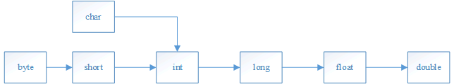

# 数据类型转换

数据类型转换分为两种：

- 自动类型转换，也称为隐型转换
- 强制类型转换

## 自动类型转换

当将某数据类型的值赋值给某个能够表示更大范围的数据类型的变量时，会发生自动类型转换，比如

```java
byte b = 20;
int a = b;
```

上面的`b`是`byte`类型，`a`是`int`类型，`int`类型的范围更加的大，所以将`b`赋值给`a`时会自动类型转换，将`20`转化为`int`类型赋值给`a`，但是`b`还是`byte`类型。


但是不能将大范围的数据类型的值赋值给更小范围数据类型的变量，如

```java
int a = 20;
byte b = a; //不行，编译器会报错
```


范围从小到大的顺序为



箭头代表可以转换。


在前面我们提及到，当将一个整数赋值给`long`类型的变量时，如果表示的范围没有超过`int`，那么可以不写后面的`L`，这时因为发生了自动类型转换

```java
long l = 12; //后面没有加L，Java默认整数类型为int，这里发生了自动类型转换
```


## 强制类型转换

上面提及到大范围不能转向小范围，但是我们可以强行转换，比如我想将`int`类型的数值转化为`byte`类型的数值

```java
int a = 20;
byte b = (byte) a;
```

在要转换的数据前面加上`(byte)`就可以强行转化为`byte`类型。


虽然可以将大范围转化为小范围，但是我们在平常时不会这么干，因为往往将大范围的数转化为小范围的数时，会有精度损失，比如：

```java
double d = 3.5;
int i = (int) d; //结果为3，小数点后面的数直接舍去，并不是四舍五入
```


我们知道`Java`的整数默认为`int`，那么下面的语句为什么没有报错

```java
byte b = 20; //20是int类型，int不能转byte，为什么没有报错
short s = 30; //同上
```

这是因为，在编译时，编译器会检查右边数值的范围，如果没有超过`byte`或者`short`能够表示的大小，那么编译器会自动帮我们强制类型转换为`byte`或`short`，相当于

```java
byte b = (byte) 20;
short s = (short) 30;
```

## 几点注意

1. `char`,`short`,`byte`类型在进行计算时，会自动提升为`int`类型参与计算

```java
byte num1 = 10;
byte num2 = 20;
//下面这行语句会报错
byte num3 = num1 + num2; //在计算时，num1和num2会自动的提升为int类型，而int类型不能转为byte，所以会报错
```

但是，下面的写法是正确的

```java
byte b = 1 + 2;
```

当右边全是常量时，编译器在编译时会直接计算，相当于下面

```java
byte b = 3;
```

由于`3`没有超出`byte`能够表示的范围，所以会被强制转换为`byte`。


```java
char c = 'A';
//下面这行语句会输出一个数字
System.out.println(c + 0); //65
```

我们知道`char`是一个字符，那么为什么字符可以进行计算呢？这是因为计算机在底层是使用数字表示字符的，比如上面`'A'`就是使用数字`65`表示的，上面的字符与数字`0`进行计算，会自动提升为`int`类型，所以最后输出的就是数字。


我们需要知道几个特殊字符对应的数字

| 字符  | ASCII码 |
| ----- | ------- |
| `'0'` | 48      |
| `'A'` | 65      |
| `'a'` | 97      |
大写字母与小写字母之间差`32`。

2. `boolean`类型不能进行数据类型转换

例如，下面将对`boolean`类型进行转换，是错误的写法：

```java
int i = 1;
boolean b1 = i; //错误
boolean b2 = (boolean) i; //错误
```

```java
boolean b = true;
int i1 = b; //错误
int i2 = (int) b; //错误
```

