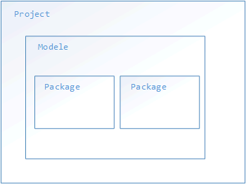

# IDEA

之前我们写`Java`程序，都是在记事本中完成的，这样开发的效率其实不高，我们需要专门的软件来提高我们开发的效率，这样的软件一般集成了很多开发的工具，一般我们称它为`IDE`，是集成开发环境的英文缩写。下面我们介绍的软件为`IDEA`，它是一款专门用来开发`Java`程序的软件。

## IDEA的项目结构

`IDEA`的项目结构为

## IDEA常用快捷键

`psvm + Enter`，快速生成`public static void main(String[] args){}`

`sout + Enter`，快速生成`System.out.println();`

`Alt + Enter`，自动修正代码，导入包

`Ctrl + Alt + L`，格式化代码

`Ctrl + Y`，删除光标所在行

`Ctrl +D`，重复当前行

`Ctrl + /`，单行注释

`Ctrl +shift + L`，多行注释

`Alt + Shift + 上下箭头`，移动当前行代码

##如何导入Modele

`File - Project Strcture - import module`

