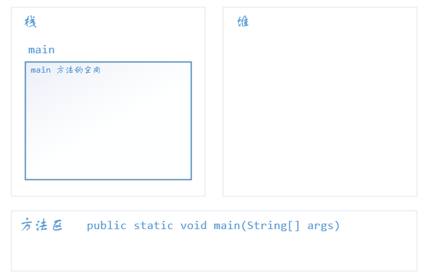
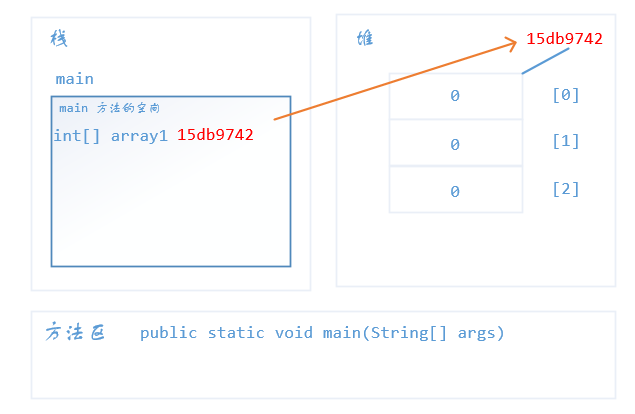
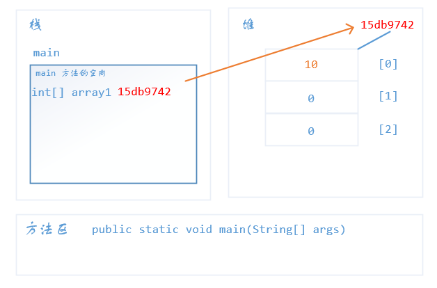
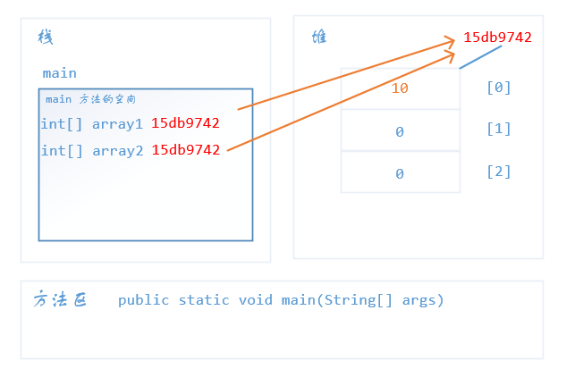
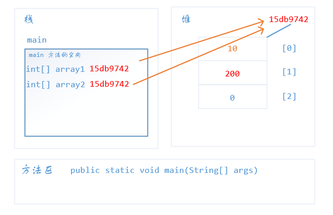

# 数组的内存图

下面我们来看一段代码，然后从内存的角度看看发生了什么

```java
public static void main(String[] args) {
    int[] array1 = new int[3];
    System.out.println(array1); // 猜猜打印出什么
    
    array1[0] = 10;
    System.out.println(array1[0]);
    
    int[] array2 = array1;
    System.out.println(array2); 
    array2[1] = 200;
    System.out.println(array1[1]);
}
```

上面代码的输出为

```java
[I@15db9742
10
[I@15db9742
200
```

下面将从内存的角度解释，首先第一行

```java
public static void main(String[] args)
```

该方法的信息会保存在方法区中，如果方法区中没有该方法，那么程序会报错。然后找到`main`方法后，这时会把`main`推入栈中，栈内存会为`main`方法开辟一块空间



```java
int[] array1 = new int[3];
```

这一行是动态初始化数组，首先会在`main`方法中分配一块空间保存变量`array1`的值，在堆中会开辟一块空间，空间的大小为`3`个`int`的大小，里面的默认值为`0`，在堆中存放的东西都有一个地址，`array1`保存的就是这个地址。访问数组就是通过这个地址去访问在堆中保存的数据的。



```java
System.out.println(array1);
```

这一行打印变量`array1`的值，我们知道`array1`保存的是数组在堆中的地址，所以输出的是`[I@15db9742`，其中`[`代表类型为数组，`I`代表是`int`类型，`@`符号后面的十六进制数字是地址的哈希值。

```java
array1[0] = 10;
System.out.println(array1[0]);
```

第一行是对数组中的第一个元素赋值为`10`，原来数组中的元素默认为`0`，现在改变为了10。在内存中的过程为，首先根据`array1`保存的地址去寻找在堆中的数组，然后根据索引值去寻找对应的位置，然后对数据进行修改



```java
int[] array2 = array1;
System.out.pritnln(array2);
```

这行语句声明了一个数组变量`array2`，它的值与`array1`的值相同，所以输出结果为`[I@15db9742`。这表示两个数组变量指向在堆中的同一个数组



```java
array2[1] = 200;
System.out.println(array1[1]);
```

上面的语句表示通过`array2`修改数组中的元素`array2[1]`为`200`，由于`array1`和`array2`指向的是同一个数组，所以`array2`对数组进行修改也会影响到`array1`。所以输出的结果是`200`而不是`0`。

