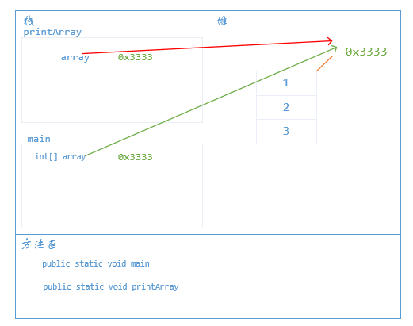

# 数组与方法

数组可以作为函数的参数，也可以作为函数的返回值返回。

## 方法作为函数参数

下面定义一个方法，该方法的作用是打印出数组里面的所有的元素，该方法接收一个整型的数组参数。

```java
public static void printArray (int[] array) {
    for (int i = 0; i < array.length; i++) {
        System.out.println(array[i]);
    }
}
```

下面在`main`方法中调用该方法

```java
int[] array = { 1, 2, 3 };
printArray(array);
```

输出为

```java
1
2
3
```

**注意：**

- 数组传递的是地址值，所以`printArray`方法中的`array`与`main`方法中的`array`指向的是同一个数组，所以如果在`printArray`方法中对数组元素进行修改的话，会影响到`main`方法中的`array`。



- 随着`printArray`方法的执行完成，在栈内存中会将为`printArray`开辟的空间出栈，此时`printArray`方法中的`array`变量会立即消失。
- 不仅是数组，引用类型作为方法的参数，传递的都是地址值

## 数组作为方法返回值

下面有一个方法，该方法接收一个数组，返回该数组的所有数字之和及平均数，由于`return`语句只能返回`0`或`1`个值，要返回两个值的话，我们可以返回一个数组，数组的第一个值表示和，第二个值表示平均数。

```java
public static double[] getSumAndAvg (int[] array) {
    double sum = 0;
    for (int i = 0; i < array.length; i++) { //求和
        sum = sum + array[i];
    }
    double avg = sum / array.length; //得到平均数
    double[] result = { sum, avg };  //创建一个数组，第一个值为sum 第二个值为avg
    return result;
}
```

在`main`方法中调用该方法

```java
int[] array = { 1, 4, 7, 9, 5};
double[] resArr = getSumAndAvg(array);    //得到数组
System.out.println("Sum is " + resArr[0]); //打印输出和
System.out.println("Average is " + resArr[1]); //打印输出平均数
```

输出为

```java
Sum is 26.0
Average is 5.2
```

注意：

- 方法返回时数组的地址值，内存分析过程同上类似
- 返回引用数据类型，返回的也是地址值

