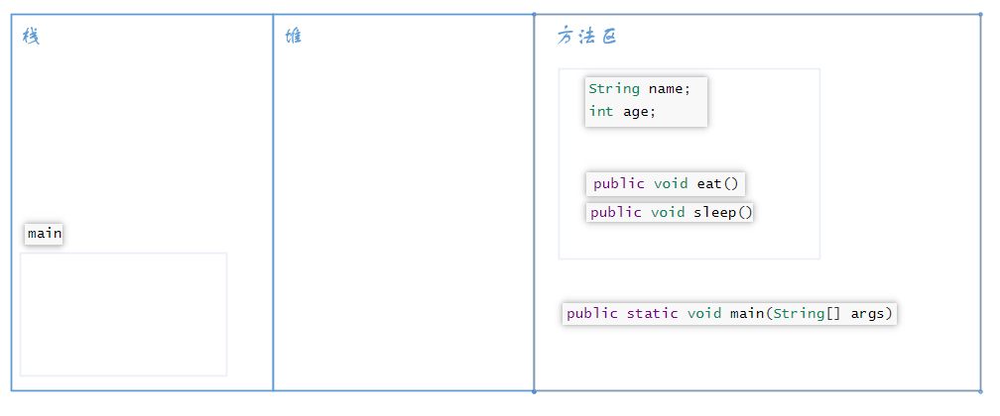
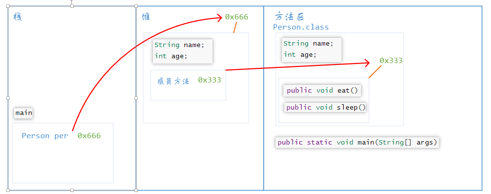

# 类的内存模型

我们来看看执行下面的代码，在内存中发生了什么

```java
public class Person {
    String name;
    int age;
    
    public void eat() {
        System.out.println("吃吃吃");
    }
    public void sleep() {
        System.out.println("睡睡睡");
    }
    
    public static void main(String[] args) {
        Person per = new Person(); //创建一个名为per的对象
        System.out.println(per.name);
        System.out.println(per.age);
        per.eat();
        per.sleep();
    }
}
```

编译器首先会在方法区中找`main`方法，然后将它推入栈中



```java
Person per = new Person();
```

这行语句会在`main`中创建一个`per`变量，接着会在堆中开辟出一块空间，存储的是`per`这个对象，这个对象是以方法区中的类为模板的，该对象具有成员变量和成员方法。但是注意的是，对象的成员方法是地址值，指向方法区中的方法的信息，当调用方法时，会根据该地址值去方法区中寻找该方法。由于每个对象的行为都是一样的，只是属性不同，所以不要在堆中为每一个对象都开辟空间是保存方法的信息，只需要保存一个地址值即可。这样做可以节省内存空间。



```java
System.out.println(per.name);
System.out.println(per.age);
per.eat();
per.sleep();
```

上面的语句是访问对象的成员变量和成员方法，首先会根据`per`对象保存的地址值，去堆中寻找对应的保存地址，然后根据成员变量名去访问数据。调用成员方法，分为了四步，第一步是根据`per`对象的地址值找到堆中的方法；第二步，堆中的方法保存的地址值，根据堆中的地址值去方法区中查找方法的信息；第三步，将方法压入栈中，栈会为该方法开辟一块空间；第四步，方法执行完毕，方法被栈移除。

