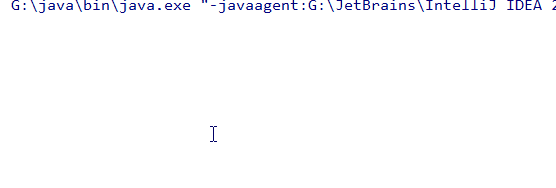
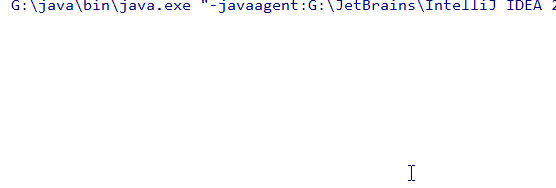

# Scanner

我们之前做的都是从屏幕输出，现在将介绍如何获取从键盘输入。`Scanner`类是系统提供的一个类，它可以帮助我们从键盘获取输入。一般使用系统提供的类分为三部分

- 导包
- 创建对象
- 使用

导包语句放在`package`之后，放在`public class`之前，如果使用的类与当前类属于同一个包，那么不用导入，如果要使用的类在`java.lang`包下，也不需要导入。导包的格式为

```java
import 包名.类名; //导入指定包下面的类
import 包名.*;  //导入指定包下的所有类
```

`Scanner`类位于`java.util`包下，所以我们需要导入，下面介绍如何使用`Scanner`类

```java
import java.util.Scanner;  //1. 导包

public class TestScanner {
    public static void main(String[] args) {
        //2. 创建一个Scanner对象
        //Scanner的构造方法需要传入参数，这里传入的是System.in，代表的是从键盘输入
        Scanner sc = new Scanner(System.in);
        
        //3. 使用
        int num = sc.nextInt();   //获得从键盘输入的一个整数
        String str = sc.next();   //获得从键盘输入的一个字符串
        //打印输入的结果
        System.out.println(num);
        System.out.println(str);
    }
}
```

程序运行效果为：



**注意：**

- 其实从键盘输入全部都是字符串，即使你输入的是`65`这里的整数，系统得到的只是对于的`ASCII`码值，而`nextInt()`方法之所以能获得整数，是因为`nextInt()`方法做了处理，将字符串转化为了整数。
- `next()`方法只能获得一个字符串，如何输入的是`Hello World`，它只能的得到`Hello`。



