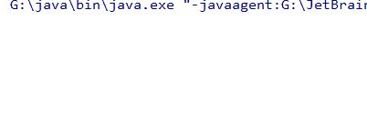

# 匿名对象

所谓的匿名对象，指的就是没有名字的对象。即在创建对象时，并没有为它赋予变量名。由于它没有名字，没有变量保存它的地址，所以它只能够使用一次，如下

```java
int num = new Scanner(System.in).nextInt();
```

如果某个对象只使用一次的话，我们可以考虑使用匿名对象。

## 匿名对象作为方法的参数

匿名对象也是对象，当然可以作为方法的参数。匿名对象传入方法的是地址值，下面举一个例子

```java
import java.util.Scanner;

public class Anonymous {
    //getNum方法接收一个Scanner对象，返回一个int类型的数值
    public static int getNum(Scanner sc) {
        int num = sc.nextInt();
        return num;
    }
    public static void main(String[] args) {
        //传入了一个匿名对象
        int num = getNum(new Scanner(System.in));
        System.out.println(num);
    }
}

```

程序运行效果为



## 匿名对象作为方法的返回值

匿名对象也可以作为方法的返回值，返回的也是地址值

```java
import java.util.Scanner;

public class Anonymous {
    //返回一个Scanner对象
    public static Scanner getScannerObject() {
        return new Scanner(System.in);
    }
    public static void main(String[] args) {
        //GetScannerObject方法返回一个Scanner对象
        Scanner sc = getScannerObject();
        String str = sc.next();
    }
}

```

程序运行效果为


