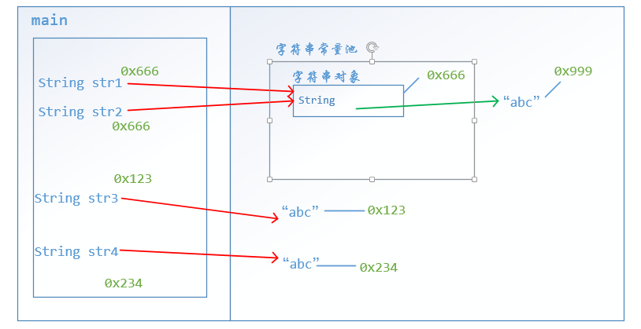

# String

`String`这个类是我们最常用的一个类了，因为我们会牵涉到很多的字符串的操作，所以这里要详细讲一下`String`类。

## String类的定义

`String`类位于`java.lang`包中，我们在之前讲过，`java.lang`是默认导入的，所以我们不需要导入这个包，这也是为什么在之前我们可以直接的使用`String`这个类。字符串效果上相当于是一个字节数组。

`String`作为引用类型，所以`String`对象的创建当然要借助于构造方法了，`String`的构造方法有很多，这里只讲常见的三种`String`构造方法。

- `public String()`
  - 创建一个空字符串
- `public String(char[] array)`
  - 根据一个字符数组来创建一个字符串
- `public String(byte[] array)`
  - 根据一个字节数组来创建一个字符串

下面我将演示通过这三种方法创建字符串对象。

```java
public class TestString {
    public static void main(String[] args) {
        String str1 = new String(); //""
        char[] chars = {'a', 'b', 'c'};
        String str2 = new String(chars); //"abc"
        byte[] bytes = {97, 98, 99};
        String str3 = new String(bytes); //"abc"

        System.out.println(str1);
        System.out.println(str2);
        System.out.println(str3);

    }
}
```

输出为

```java

abc
abc
```

因为字符串是在是太常用，通过构造方法创建有点麻烦，所以系统设计出可以通过`""`的字面量的形式来创建一个`String`对象，这也是我们经常使用的方式

```java
String str = "abc";
```

**注意：**

- `Java`程序中所有字符串的字面值（`""`）都是`String`类的实例
- 字符串一旦创建不可改变

## 常量池

我们知道可以通过字面量（`""`）的形式来创建字符串对象，这样创建对象与使用构造方法创建的对象有什么不同呢？下面我们来看一个字符串比较的例子

```java
public class ConstantString {
    public static void main(String[] args) {
        String str1 = "abc";
        String str2 = "abc";

        String str3 = new String(new char[]{'a','b','c'});
        String str4 = new String(new byte[]{97, 98, 99});

        System.out.println(str1);
        System.out.println(str2);
        System.out.println(str3);
        System.out.println(str4);
    }
}

```

输出为

```java
abc
abc
abc
abc
```

在这里我们创建了四个字符串，他们的内容都是`"abc"`，现在我要对它们进行比较

```java
System.out.println(str1 == str2);
System.out.println(str1 == str3);
System.out.println(str1 == str4);
System.out.println(str3 == str4);
```

输出结果为

```java
true
false
false
false
```

这里得到的结果可能与你想象的不一样，所以我要详细讲一下。

首先`==`比较符比较的是什么？由于字符串都是引用类型，所以这里比较的是它们的地址，那按道理说，每创建一个对象，会在堆中开辟一个空间，每个空间的地址都不一样，那么它们比较的值应该都是`false`，那么为什么通过字面量创建的字符串对象比较出来的结果是`true`呢？

要解释这一个现象，就需要知道一个东西，那就是常量池。程序中直接用双引号写上的（即通过字面量创建的字符串），都在常量池中，而`new`出来的对象不再常量池中。现在记住这一句话，我们去内存看看到底怎么回事，由于这次不牵涉到方法区，我们只画出栈内存和堆内存。



## 字符串的相关方法

### 字符串比较

之前我们说`==`比较是基于地址的比较，但是我们如果基于内容比较怎么办？比如说上面的字符串如果进行比较的话，就会返回`true`。有两个方法，第一个是`equals()`方法，该方法其实也是基于`==`比较的，不过`String`类重写了该方法，只要两个字符串的内容相同就会返回`true`。这里又提到了重写，不懂没关系，只要知道，字符串调用这个方法是基于内容的比较，而不是基于地址的比较，下面演示一番。

```java
public class CompareString {
    public static void main(String[] args) {
        String str1 = "abc";
        String str2 = "abc";
        String str3 = new String(new char[]{'a','b','c'});
        String str4 = new String(new byte[]{97, 98, 99});

        System.out.println(str1.equals(str2));
        System.out.println(str1.equals(str3));
        System.out.println(str1.equals(str4));
        System.out.println(str3.equals(str4));
    }
}
```

输出为

```java
true
true
true
true
```

注意：

- `equals()`方法具有对称性
- 如果比较的双方一个是常量，一个是变量，推荐使用常量调用方法

针对第二条的原因是，如果变量`str`未被初始化，那么它的初始值是`null`，`null`根本没有`equals`方法，所以调用该方法会报错

```java
String str; //str = null
str.equals("abc"); //会报错
"abc".equals(str); //不会报错，会返回false
```

字符串比较的第二个方法是`equalsIgnoreCase()`，该方法与`equals`不同的是，该方法的比较忽略大小写，而`equals()`是大小写敏感的。

```java
System.out.println("hello".equalsIgnoreCase("Hello"));
```

输出为

```java
true
```

### 字符串截取

与字符串截取有关的方法是`substring()`，该方法有两种常用的重载

- `substring(int index)`
  - 从`index`截取到末尾
- `substring(int begin, int end)`
  - 从`begin`截取到`end`，左闭右开`[begin, end)`

### 字符串转换

介绍三个方法

- `toCharArray()`
  - 将字符串转换为`char[]`
- `getBytes()`
  - 将字符串转换为`byte[]`
- `replace(CharSequence oldString, CharSequence newString)`
  - 这里的`CharSequence`是接口，这里不懂也没关系，知道这个可以接收字符串类型就可以
  - 这个方法的作用是新的字符串替换旧的字符串

### 字符串分割

与字符串分割的方法只有一个

- `split(String regex)`
  - 按照`regex`的规则分割字符串，返回一个字符串数组

按照`regex`的规则分割字符串可能有点难以理解，其实这里的`regex`是正则表达式，不懂的话看懂下面的例子就可以

```java
public class SplitString {
    public static void main(String[] args) {
        String str = "a,b,c";

        String[] strings = str.split(","); //按照逗号的分割字符串，得到的是["a","b","c"]
        for (int i = 0; i < strings.length; i++) {
            System.out.println(strings[i]);
        }
    }
}
```

输出为

```java
a
b
c
```

注意：

- 如果要按`"."`规则分割的话，不能写`"."`，要写成`"\\."`，因为`.`在正则表达式中有特殊的含义，所以需要转义。