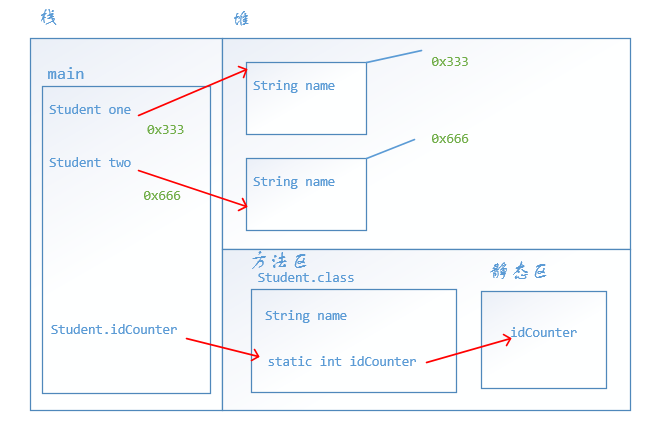

# static关键字

`static`关键字我们在之前见到过很多次了，比如

```java
public static void main(String[] args){
    
}
```

或者在定义方法时

```java
public static void add() {
    
}
```

都用到`static`，而在成员方法中却没有用到`static`，所以这里我们就来看看`static`到底是什么，它有什么用。

## static修饰符的作用

一旦被`static`修饰，不管是变量还是方法，那么这么变量或方法不再是属于某个对象的，而是属于类，相当于说被`static`修饰之后，就不是某个人的私有财产，而是大家的公共财产。被`static`修饰的变量和方法分别叫做静态变量和静态方法。


访问`static`修饰的变量或方法，可以通过`.`语法，可以通过类名`.`，也可以通过对象名`.`。以前我们调用成员变量和成员方法就是通过对象名`.`出来的。但是这里推荐使用类名`.`，这样大家一眼就可以看出这是共有财产而不是私有财产。而且即使你使用了对象名`.`，在编译器编译时也会自动转换为类名`.`。


为了理解`static`修饰符，我们来看这么一个例子。假设有一个`Student`类，里面有一个`id`成员变量，我们希望每当创建一个对象时，会自动赋予`id`变量一个值，比如说，如果`one`第一个创建的学生，那么它的`id`就是`1`，一次类推。我们可以使用一个`static`变量`idCounter`来计数，每创建一个对象它就加一

```java
public class Student {
    String name;
    int id;
    static int idCounter;

    public Student() {
        //每创建一个对象，id计数器加一，并且赋给id
        this.id = ++idCounter;
    }
    public Student(String name) {
        this.name = name;
        //每创建一个对象，id计数器加一，并且赋给id
        this.id = ++idCounter;
    }

    public static void main(String[] args) {
        Student one = new Student("one");
        System.out.println("我的名字是：" + one.name + "我的id是："  + one.id);
        Student two = new Student("two");
        System.out.println("我的名字是：" + two.name + "我的id是："  + two.id);
    }
}
```

输出为

```java
我的名字是：one我的id是：1
我的名字是：two我的id是：2
```


这里我要解释一下，为什么有的方法使用`static`修饰了，我们知道，如果使用`static`修饰，该方法就可以通过类`.`出来，如果这个方法是本类的，那么类名可以省略不写。比如这样

```java
public static void add() {
    
}
public static void main(String[] args) {
    //在这里调用add方法，属于同一个类，可以省略类名
    add();
}
```

如果我们需要直接在`main`方法中直接使用这个方法，我们就会使用`static`修饰。这里只是解释前面为什么有的方法要使用`static`修饰，因为我们希望直接调用。


这里有关`static`有几个需要注意的事项

- 静态只能访问静态，静态不能访问非静态。即在静态方法里面，不能访问成员变量，也不能调用成员方法。这时因为在内存中，先有静态内容，后有非静态内容。“先人不知后人，后人知道先人”。
- 静态方法中不能使用`this`。我们知道，谁调用这个方法，那么`this`就是这个对象。但是调用静态方法是类，而不是对象，即使使用对象调用静态方法，编译器在编译时也会转换为类调用。

## static的内存图

在方法区中有一块内存空间，专门用以保存静态变量的



从上面的图可以看出来，静态变量与对象没有任何关系。

## 静态代码块

静态代码块的格式是

```java
static {
    
}
```

该代码块写在类中。它的特点是在第一次创建对象的时候执行唯一的一次。后面在创建对象不会再执行。它先于构造方法的执行。它的作用一般是为了初始化静态变量。