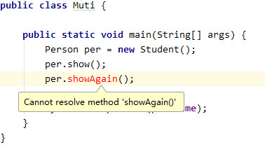
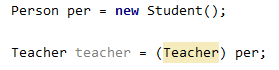
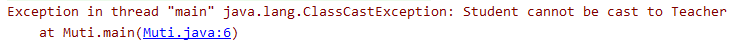

# 多态

继承和实现接口是多态的基础。

## 多态的定义

多态的定义就是父类引用指向子类对象。

```java
父类 对象名 = new 子类();
接口 对象名 = new 实现类();
```

如假设有一个父类`Person`和一个子类`Student`如下

```java
public class Person {
	String name = "父类";	
    public Person() {
    }

    public void show() {
        System.out.println("我是父类的show方法");
    }
}
```

```java
public class Student extends Person{
	String name = "子类";
    @Override
    public void show() {
        System.out.println("我是子类的show方法");
    }
}

```

现在我使用多态的写法，创建一个`Student`对象指向`Person`引用，并且调用`show`方法

```java
public class Muti {
    
    public static void main(String[] args) {
        Person per = new Student();
        per.show();
        
        System.out.println(per.name);
    }
}

```

这时的输出为

```java
我是子类的show方法
父类
```

是不是有点难以理解上面的输出，下面讲解一下为什么会有上面的输出。

## 多态访问成员变量和成员方法的规则

### 访问成员方法的规则

- 如果多态写法创建的对象，调用成员方法时，在编译时看左边，即看父类有没有这个方法，如果父类没有，那么会报错，如下面我在`Student`中新建了一个子类特有的方法，如果使用`per`对象调用的话，将会发生错误。

```java
public class Student extends Person{

    String name = "子类";

    @Override
    public void show() {
        System.out.println("我是子类的show方法");
    }
    
    public void showAgain() {
        System.out.println("我是子类特有的方法");
    }
}
```



我们观察到程序报错了，因为父类并没有这个方法。

- 在运行时看右边，即如果这个方法子类重写了，那么调用子类的方法，我们在上面也看到了，输出的是子类的方法
- 口诀：“编译看左边，运行看右边“

### 访问成员变量的规则

访问成员变量的规则与访问成员方法的规则不同。

- 访问成员变量时，编译时的规则也一样，如果父类没有该变量，则访问不了该变量。访问不了子类的变量。
- 即使子类中的成员变量与父类中的成员变量重名，那么访问的也是父类的成员变量，在上面我们已经看到了，我们在打印输出`name`是输出的是父类的成员变量。
- 口诀：“编译看左边，运行也看左边”

## 对象转型

对象转型分为向上转型和向下转型。

### 对象向上转型

多态就是向上转型，因为是子类对象指向父类的引用。创建的是子类的对象，但是使用却是当做父类对象使用。多态有一个明显的弊端就是无法使用子类特有的方法和子类的成员变量。

### 对象向下转型

我们提到了多态的弊端，但是我就是要使用子类的特有方法怎么办，这个时候我们可以使用向下转型，比如

```java
Person per = new Student();
Student stu = (Student) per; //向下转型
```

这样我们就可以使用`Student`对象特有的方法了，比如

```java
public class Muti {

    public static void main(String[] args) {
        Person per = new Student();

        Student stu = (Student) per;
        stu.showAgain();
    }
}
```

输出为

```java
我是子类特有的方法
```

但是，向下转型要注意，我原来是`Student`对象才能转为`Student`对象，我如果原来不是，那么运行时会抛出异常，如下面我创建一个`Teacher`继承了`Person`，现在我要把`per`强行转型为`Teacher`对象



我们观察到，在编译时并没有报错，现在我们来运行一下



抛出了`ClassCastException`异常，意思是类型转换异常。所以向下转型不安全。


那我们为什么不直接创建一个子类对象指向子类呢？何必多次一举使用多态写法然后又给转回来呢？我们来看这么一个方法

```java
public void someMethod(Person per)
```

这个类的方法参数只要求是`Person`就可以，它不管你是`Student`还是`Teacher`，所以如果我们把`Student`对象传进去，这是不是多态的写法，如果我们在里面要用到`Student`特有的方法，我们是不是要向下转型。


其实常常我们使用接口作为参数，表示的意思就是我才不管你是什么，你只有实现我的接口就可以了，那么我就可以使用你了。比如有一个接口叫做`USB`，那么传进来的参数，你只要实现了我们`USB`接口就可以，不管你是鼠标实现了还是键盘实现了，你只要实现了，我就可以用。这就是多态的用法啊。

## instanceof

上面我们说了，对象的向下转型是有风险的，因为如果我不是`Student`你给我转给`Student`那么会抛出异常的。现在`instanceof`关键字可以解决这个问题，他可以判断多态创建的父类引用为哪个子类。具体用法为

```java
多态创建的父类引用 instanceof 子类
```

该表达式返回一个`boolean`值，如果多态创建的父类引用是这个子类，那么返回`true`，否则返回`false`。例如

```java
Person per = new Student();
per instanceof Student; //true
per instanceof Teacher; //false
```

现在考虑这么一个函数

```java
public void someMethod(Person per)
```

我们现在就在方法中根据`per instanceof Xxx`的结果进行安全的向下转型

```java
public void someMethod(Person per) {
    if (per instanceof Student) {
        Student student = (Student) per;
        //实现Student对象特有的操作
    } else if (per instanceof Teacher) {
        Teacher teacher = (Teacher) per;
        //实现Teacher对象特有的操作
    }
}
```

