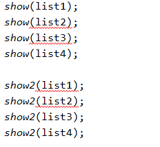

# 泛型

## 概述

泛型我们之前在使用`ArrayList`集合时就已经接触过，那么为什么会使用泛型，比如我现在在写一个集合，但是我不知道别人会保存什么数据类型，我不能写死了说只能保存`String`类型，这个时候我就会使用泛型，就像`ArrayList`一样。

如果省略泛型的话，那么默认为`Object`类型，比如下面我创建一个`ArrayList`集合，没有写泛型

```java
import java.util.ArrayList;

public class GenericsDemo {
    public static void main(String[] args) {
        ArrayList list = new ArrayList();
        list.add("AA");
        list.add(2);
        list.add('c');

        for (int i = 0; i < list.size(); i++) {
            System.out.println(list.get(i));
        }
    }
}
```

输出为

```java
AA
2
c
```

这个时候`ArrayList`集合的对象能够添加任何的数据类型，因为所有的类都继承了`Object`类，而基本数据类型会进行自动装箱操作转化为对应的包装类。其实上面就是多态的写法，而多态的写法我们也知道它的弊端，他不能调用子类特有的方法，如果我们需要调用子类的方法的话就需要向下转型，这很容易发生异常，并且在编译时不会报错。并且一般我们在集合保存相同的数据类型，所以这个时候我们可以使用泛型。使用泛型的话至少有这两个优点

- 避免了类型转换的麻烦
- 编译时就可以看到错误
  - 如果一个`String`的`ArrayList`添加`Integer`数据，那么编译时就会报错

## 泛型的定义

### 类

泛型定义在类中的格式应该如下

```java
public class ClassName<E> {
    
}
```

其中`E`就代表泛型，它会在创建对象的时候确定`E`是什么类型，比如`ArrayList<String> list = new ArrayList<>();`，那么这个时候`E`就是`String`。这么定义以后，我们就可以在类中的方法中使用`E`，如

```java
public void method(E e) {
    
}
```

```java
public E method() {
    
}
```

可以让它作为方法的参数和返回值，如果在创建对象的时候传入的`E`是`String`，那么这些方法的参数或者返回全部都是`String`类型的。我们可以看做`E`是一个接收类类型的变量。

### 方法

方法中定义泛型，格式如下

```java
修饰符 <泛型> 返回值 方法名(参数列表) {
    
}
```

比如下面这么定义

```java
public <M> void method (M m) {
    
}
```

泛型会在调用方法时确定，比如传入的是一个`String`类型的参数，那么`M`就是`String`。

### 接口

在接口中定义的格式如下

```java
public interface InterfaceName<E> {
    
}
```

实现类实现接口可以指定泛型是什么或者不指定，就是这个意思

- 指定

```java
实现类 implements InterfaceName<String> {
    
}
```

- 不指定

```java
实现类<E> implements InterfaceName<E>
```

## 通配符

假设我要写一个方法，输入一个`ArrayList`对象，要求打印输入列表的所有元素，但是`ArrayList`是什么类型的不知道，所以方法参数类型不能写死，不能这么写

```java
public void method(ArrayList<String> list) {
    
}
```

但是我们在上面学了方法的泛型，所以我们可以这么写

```java
public <E> void method(ArrayList<E> list) {
    
}
```

`Java`停供了一种更加方面的写法，即使用通配符

```java
public void show(ArrayList<?> list) {
    
}
```

其中`?`代表的就是通配符，指的就是能够匹配任何的数据类型。

不仅如此我们还能够对通配符进行限定，如

- `? extends E`
  - 说明参数的类型必须是`E`的子类或者`E`本身
- `? super E`
  - 说明参数的类型必须是`E`的父类或者`E`本身

比如下面

```java
import java.util.ArrayList;

public class TestTongpeifu {
    //接收的类型必须为Number类的子类或者Number类本身
    public static void show(ArrayList<? extends Number> list) { 
        System.out.println(list);
    }
	
    //接收的类型必须为Number类的父类或者Number类本身
    public static void show2(ArrayList<? super Number> list) {
        System.out.println(list);
    }
    
    public static void main(String[] args) {
        ArrayList<Integer> list1 = new ArrayList<>();
        ArrayList<String> list2 = new ArrayList<>();
        ArrayList<Object> list3 = new ArrayList<>();
        ArrayList<Number> list4 = new ArrayList<>();
        
        show(list1); //Interger是Number的子类，可以
        show(list2); //String类与Number类没有关系，报错
        show(list3); //Object不是Number的子类，报错
        show(list4); //Number本身，可以

        show2(list1); //Interger是子类，报错 
        show2(list2); //String没关系，报错
        show2(list3); //Object是父类，可以
        show2(list4); //Number本身，可以
    }


}
```



与我们分析的一致。