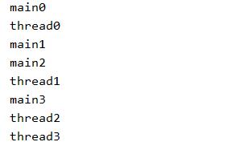
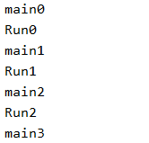
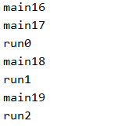

# 多线程概述

我们平时有在边听歌边看小说，同时运行多个软件，这就是多线程。同时在干多件事情，目前我们编写的程序都是单线程的，在`main`方法中从上到下的进行，执行完上面的程序才能执行后面的程序。下面就将讲解如何写多线程程序。

在`Java`中创建多线程有两种放法，一种是继承`Thread`类，然后重新它的`run()`方法。第二种是实现`Runnable`接口，并且重写`run()`方法。

## 继承Thread类

继承`Thread`类实现多线程的步骤为

- 继承`Thread`类，重写`run()`方法
- 创建子类对象，调用继承的`start()`方法

我们写一个`MyThread`类继承自`Thread`类，并重写`run`方法如下

```java
public class MyThread extends Thread {
    @Override
    public void run() {
        for (int i = 0; i < 20; i++) {
            System.out.println("thread" + i);
        }
    }
}
```

新建一个测试类，在其`main`方法中创建`MyThread`对象，并且调用对象继承自`Thread`的`start()`方法

```java
MyThread thread = new MyThread();
thread.start();
for (int i = 0; i < 20; i++) {
    System.out.println("main" + i);
}
```

程序输出为



观察到`main`方法中的程序和`MyThread`的`run()`方法中的程序在交替的进行。而不是在等待我执行完了，另一个在执行，而是两个在同时的执行，这就是多线程。

## 实现Runnable接口

实现`Runnable`接口实现多线程的步骤为

- 实现`Runnable`接口并重写`run()`方法
- 在`main`中创建实现类对象
- 将实现类对象多为参数传入`Thread()`的构造方法，得到一个`Thread`对象
- 该`Thread()`对象调用`start()`方法

下面进行演示，首先创建一个类实现`Runnable`接口

```java
public class MyRun implements Runnable{
    @Override
    public void run() {
        for (int i = 0; i < 20; i++) {
            System.out.println("Run" + i);
        }
    }
}
```

下面在实现类中实现多线程，如下

```java
Runnable run = new MyRun(); //创建实现类对象
Thread thread = new Thread(run); //实现类对象作为参数传入Thread的构造方法
thread.start(); //Thread对象调用start()方法启动线程

for (int i = 0; i < 20; i++) {
    System.out.println("main" + i);
}
```

输出为



可以观察到`main`中的程序和`run()`方法中的程序是在同时进行的。

## Thread中的常见方法

- `getName()`
  - 获得线程的名称
- `currentThread()`
  - 获得正在执行的线程
- `setName(String str)`
  - 设置线程的名字
  - 也可以通过`new Thread(String str)`设置线程的名字
- `sleep(long l)`
  - 线程休眠`l`毫秒

我们修改`MyRun`中的`run()`方法为

```java
for (int i = 0; i < 20; i++) {
    //获得当前线程并且获得当前线程的名字
    System.out.println(Thread.currentThread().getName() + i); 
} 
```

修改`main`方法为

```java
Runnable run = new MyRun();
Thread thread = new Thread(run);
thread.setName("run"); //增加了这一行，设置线程的名字
thread.start();

for (int i = 0; i < 20; i++) {
    System.out.println("main" + i);
}
```

输出结果为



