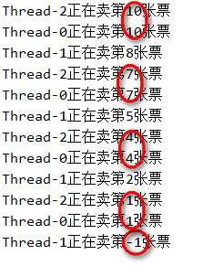
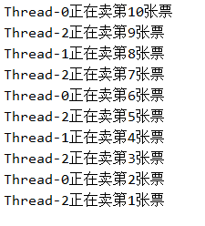
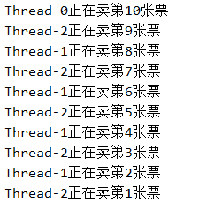
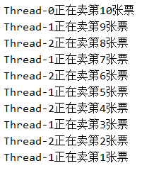

# 线程安全

## 安全问题

现在考虑这么一个问题，有三个售票机在售票，那么它们不能发生售出同样的票，也不能售出不存在的票。现在我要用一个类模拟售票机售票，并使用多线程模拟同时售票，新建一个`SellTicket`类

```java
public class SellTicket implements Runnable{
    private int ticket = 10; //总共10张票

    @Override
    public void run() {
        while (true) { //表示一直售票
            if (ticket > 0) { //如果还有票
                try {
                    //为了增加出错的可能，使当前的线程休眠1ms
                    Thread.sleep(1);
                } catch (InterruptedException e) {
                    e.printStackTrace();
                }

                System.out.println(Thread.currentThread().getName() + "正在卖第" + ticket + "张票");
                ticket --;
            }
        }
    }
}

```

在测试类的`main`方法中创建三个线程同时售票

```java
Runnable sellTicket = new SellTicket();
//创建三个线程 注意必须使用的同一个售票机对象 否则他们就是各自10张票而不是总共10张票
new Thread(sellTicket).start();
new Thread(sellTicket).start();
new Thread(sellTicket).start();
```

输出为



我们发现出现了不同的售票线程在售不同的票，并且有的售票线程售出了不存在的票`-1`。

## 线程同步

之所以会出现上面的问题，就是因为在有的售票机卖出了票，即进入了`if`语句后，但是还未进行`ticket--`操作，但是这个时候这个线程失去了`CPU`的执行权，并且别的线程拿到了`CPU`的执行权，由于未对`ticket--`，所以它们拿到的是同一张票，所以这就是为什么它们能卖出同一张票的原因。同理卖出不存在的票也是同种原因，线程`1`在剩`1`张票时，进入了`if`语句，但是还未进行`Sys...`买票，就失去了`CPU`的执行权，这时线程`2`获得了`CPU`的执行权，并且打印出`1`，未进行`ticket--`便失去执行权，这时线程`0`拿到执行权，也打印出`1`，然后这线程`2`和`0`都进行`ticket--`操作(谁先谁后不知道)，这时`ticket`就变为`-1`，等到线程`1`拿到执行权时，它就卖出了第`-1`张票。

那么如何解决这个问题，我们必须要求在售票机在完成售票并且对`ticket--`之前，别的售票机不能对`ticket`进行操作，这样就不会出现票重复和卖出不存在的票的情况了，而实现这个的技术就叫做同步。有三种实现方式，分别是

- `synchronized`代码块
- 同步方法
- `Lock`锁

下面具体介绍用法。

### sychronized代码块

`sychronized`代码块的格式为

```java
sychronized(锁对象) {
    //需要同步的代码，也就是可能出现问题的代码
}
```

其中锁对象可以是任意的对象，当一个线程执行到同步代码块时，会将该锁对象交给这个线程，当这个线程执行完同步代码块时，会释放锁对象，所以如果这个线程在同步代码块内失去了`CPU`的执行权，因为别的线程没有锁对象，就不能进入同步代码块执行，就会进入堵塞状态，等待锁对象被释放。所以锁对象就相当于是钥匙了，要保证多个线程的锁对象要相同，这样就只有一把钥匙了。

我们重新修改`SellTicket`的类如下

```java
public class SellTicket implements Runnable{
    private int ticket = 10; //总共10张票
    Object object = new Object(); //锁对象
    
    @Override
    public void run() {
        while (true) { //表示一直售票
            //同步代码块 一次只有一个线程执行
            synchronized (object) {
                if (ticket > 0) { //如果还有票
                    try {
                        //为了增加出错的可能，使当前的线程休眠1ms
                        Thread.sleep(1);
                    } catch (InterruptedException e) {
                        e.printStackTrace();
                    }
                    System.out.println(Thread.currentThread().getName() + "正在卖第" + ticket + "张票");
                    ticket --;
                }
            }
        }
    }
}
```

输出结果为



这次我们发现没有卖出重复的票，也没有卖出不可能的票。

### 同步方法

同步方法其实就是使用`synchronized`修饰的方法，这个方法每次也只能有一个线程执行，它的锁对象是`this`，我们把上面买票的程序抽取出为一个方法`sellTicket()`

```java
public synchronized void  sellTicket() {
    if (ticket > 0) { //如果还有票
        try {
            //为了增加出错的可能，使当前的线程休眠1ms
            Thread.sleep(1);
        } catch (InterruptedException e) {
            e.printStackTrace();
        }
        System.out.println(Thread.currentThread().getName() + "正在卖第" + ticket + "张票");
        ticket --;
    }
}
```

这时`run()`可简化为

```java
@Override
public void run() {
    while (true) { //表示一直售票
        sellTicket();
    }
}
```

输出为



也达到了同样的效果。

注意：

- 同步方法也可以为静态方法，不过这时的锁对象不在是`this`了，而是本类的`class`属性，也是一个对象。

### Lock锁

`Lock`是一个接口，它比较灵活。之前我们讲到，在线程执行到`synchronized`代码块时，会获得锁对象，在执行完代码块时，会释放锁对象，但是这些对我们都是不可见的，而`Lock`灵活在我们自己觉得在哪里加锁，哪里释放锁。它有两个方法

- `lock()`
  - ·加锁
- `unlock()`
  - 释放锁

`lock()`一般写在同步代码前，`unlock()`写在同步代码后。`ReentrantLock`是`Lock`的实现类，下面我们将演示如何使用`Lock`锁同步，修改`run`方法为

```java
Lock lock = new ReentrantLock(); //创建Lock锁实现类对象
@Override
public void run() {
    while (true) { //表示一直售票
        lock.lock();  //加锁
        if (ticket > 0) { //如果还有票
            try {
                //为了增加出错的可能，使当前的线程休眠1ms
                Thread.sleep(1);
            } catch (InterruptedException e) {
                e.printStackTrace();
            }
            System.out.println(Thread.currentThread().getName() + "正在卖第" + ticket + "张票");
            ticket --;
        }
        lock.unlock(); //释放锁
    }
}
```

输出为



可见达到了同步的效果。