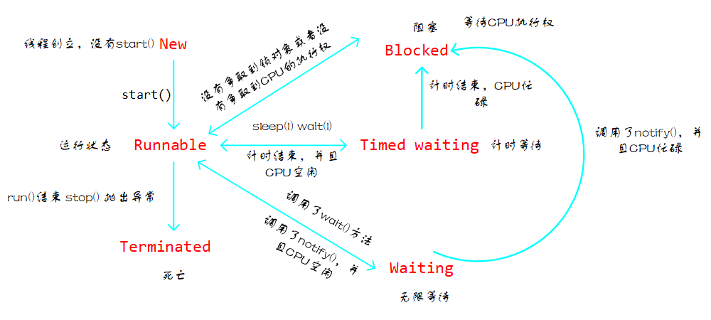

# 等待唤醒

当我们派对买奶茶时，我们对老板说我们要一杯奶茶，然后我们就等着，老板去制作奶茶，等老板制作好奶茶后去喊我们。这其实就是等待唤醒，当多个线程去操作同一个资源时，比如奶茶，就需要一方(顾客)等着，等待另一方(老板)唤醒，总不能奶茶没有好我去抢吧。

## 线程状态

在讲解等待唤醒之前，我们先对线程的状态有一个大致的了解，看图



当我们创建一个线程对象还没有`start()`时，这时它处于`New`状态；当我们执行`start()`方法后，这时的线程状态由`New`转向`Runnable`运行状态；如果执行完`run()`方法，或者调用了`stop()`方法或者抛出了异常那么该线程进入死亡状态。如果在`Runnable`状态失去了`CPU`的执行权，那么就会进入`Blocked`阻塞状态；线程在这里等待`CPU`的执行权，拿到了`CPU`的执行权就会从该状态来到`Runnable`状态；如果线程在运行时执行了`sleep(l)`或`wait(l)`(`l`为等待的时间)方法，那么就会由`Runnable`状态进入`Timed waiting`状态，在这个状态中，线程放弃争夺`CPU`的执行权，当等待的时间到了之后，如果`CPU`空闲，那么就进入`Runnable`状态，如果忙碌，那么就进入`Blocked`状态，与其他线程一起争夺`CPU`的执行权。如果在`Runnable`执行了`wait()`(不带参数的)方法，就会进入`Waiting`永久等待状态，直到锁对象执行`notify()`方法唤醒，如果`CPU`空闲，就进入`Runnable`状态，否则进入`Blocked`状态争夺`CPU`执行权。

## 等待唤醒

这里的等待唤醒指的就是上面提及的`Runnable`状态执行`wait()`方法到`Waiting`永久等待状态，以及执行`notiify()`方法有永久等待状态到`Runnable`状态。前者为等待，后者为唤醒。

注意：

- 只有锁对象才能调用`wait()`和`notify()`方法
- `wait()`和`notify()`的调用者应该是同一锁对象，并且必须写在同步代码块中
- 执行`wait()`被唤醒后，会继续执行`wait()`后面的代码
- `notify()`一次只能唤醒一个线程，唤醒的是睡眠最久的线程，`notifyAll()`能够唤醒所有的线程

下面以最先提及的买奶茶为例演示这一过程。首先创建`Runnable`顾客类和老板类和奶茶类

```java
public class MilkTea {
    String taste; //奶茶口味

    boolean flag = false; //奶茶有没有做好
}
```

```java
public class CustomerThread implements Runnable {

    private MilkTea milkTea; //作为锁对象

    public CustomerThread(MilkTea milkTea) {
        this.milkTea = milkTea;
    }

    @Override
    public void run() {
        while (true) {
            synchronized (milkTea) { 
                if (milkTea.flag == false) { //奶茶没有准备好
                    System.out.println("老板来杯珍珠奶茶");
                    try {
                        milkTea.wait(); //等待
                    } catch (InterruptedException e) {
                        e.printStackTrace();
                    }
                }
                System.out.println(milkTea.taste + "真好喝"); //被唤醒后会执行这个
                milkTea.flag = false; //奶茶喝完了
                milkTea.notify();
            }
        }
    }
}
```

```java
public class Shopper implements Runnable {
    private MilkTea milkTea; //作为锁对象 和Customer相同

    public Shopper(MilkTea milkTea) {
        this.milkTea = milkTea;
    }

    @Override
    public void run() {
        while (true) {
            synchronized (milkTea) {
                if (milkTea.flag == true) {
                    try {
                        milkTea.wait(); //等待
                    } catch (InterruptedException e) {
                        e.printStackTrace();
                    }
                } else {

                    try {
                        System.out.println("做奶茶中 ...");
                        Thread.sleep(3000);
                    } catch (InterruptedException e) {
                        e.printStackTrace();
                    }

                    milkTea.taste = "珍珠奶茶";
                    milkTea.flag = true;
                    System.out.println(milkTea.taste + "做好了");
                    milkTea.notify();
                }
            }
        }
    }
}
```

下面在测试类中创建两个线程

```java
public class Test {
    public static void main(String[] args) {
        MilkTea milkTea = new MilkTea(); //作为锁对象
        new Thread(new CustomerThread(milkTea)).start();
        new Thread(new Shopper(milkTea)).start();
    }
}

```


输出为


这就是等待唤醒的过程。