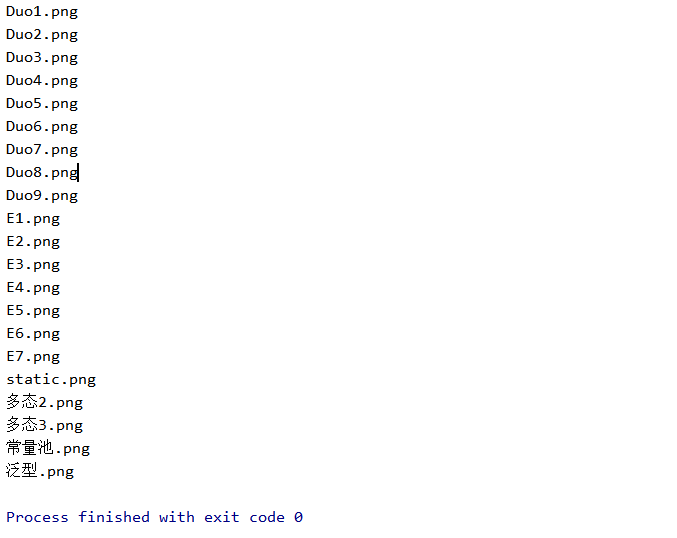

# 过滤器

`listFiles`其实还可以接收一个叫做过滤器的参数。这个过滤器是一个接口，分为有`FileFilter`和`FilenameFilter`两个接口，这两个接口里面都只有一个方法`accept()`，`listFiles`会调用这个方法，将它获得的路径传入该方法中，如果得到的结果为`true`，那么就保留这个路径在最终返回的数组中，如果返回的是`false`，那么就不要这个路径。可见这样就起到了文件过滤的作用，而过滤什么样的文件，需要什么样的文件，完全由`accept()`方法决定，所以这也是它们为什么叫做过滤器的原因。

## FileFilter

下面来介绍`FileFilter`，`FileFilter`里面的`accept(File pathname)`接收一个参数，这个参数就是路径名，`listFiles()`会将它获得的路径传入`accept()`，`accept()`进行过滤，以决定要什么样的路径。下面我们做一个示范，打印出一个图片文件夹里面以`.png`结尾的图片

```java
//传入的是图片文件夹的路径
public static void printPNG(File file) {
    //因为接口里面只要一个方法，所以这里使用Lambda表达式
    File[] files = file.listFiles(pathname -> {
        //判断是不是以.png结尾
        boolean b = pathname.getName().endsWith(".png");
        if (b) {
            //如果是以.png结尾，则加入到files数组中
            return true;
        } else {
            return false;
        }
    });
    //打印files数组，查看结果是否正确
    for (File fi : files) {
        System.out.println(fi.getName());
    }
}
```

我们在`main`方法调用测试

```java
printPNG(new File("D:\\images"));
```

打印输出为



可见只有`.png`结尾的图片才被放入了`files`数组中。

## FilenameFilter

它的`accept(File dir, String name)`接收两个参数，其余的与`FileFilter`相同，下面就同样的功能演示其代码

```java
public static void printPNGAgain(File file) {
    File[] files = file.listFiles(((dir, name) -> {
        //根据dir和name创建一个File对象
        //后面的代码完全同上面一样
        File newFile = new File(dir,name);
        boolean b = newFile.getName().endsWith(".png");
        if (b) {
            return true;
        } else {
            return false;
        }
    }));
    for (File fi : files) {
        System.out.println(fi.getName());
    }
}
```

在`main`方法中调用该方法

```java
printPNGAgain(new File("D:\\images"));
```

输出同上面一模一样


