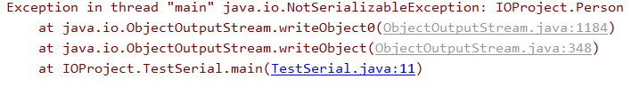

# 序列流

如果我们想将对象保存在硬盘中怎么办？因为一旦断电，内存中的对象就会全部的消失。这个时候就需要序列流将对象保存在文件中，对应也有相应的序列流读取文件得到一个对象。

- `ObjectOutputStream`
  - 将文件写到文件中的类
  - `writeObject(Object o)`
    - 该方法将对象写到文件中
- `ObjectInputStream`
  - 从文件中读取对象的类
  - `readObject()`
    - 将文件中的对象读取出来，返回一个`Object`对象

下面介绍使用及注意事项。首先创建一个`Person`类

```java
package IOProject

public class Person {
    private String name;
    private int age;

    public Person(String name, int age) {
        this.age = age;
        this.name = name;
    }

    public Person() {
    }

    public int getAge() {
        return age;
    }

    public void setAge(int age) {
        this.age = age;
    }

    public String getName() {
        return name;
    }

    public void setName(String name) {
        this.name = name;
    }

    @Override
    public String toString() {
        return "Person{" +
                "age=" + age +
                ", name='" + name + '\'' +
                '}';
    }
}
```

然后在测试类中创建一个对象，并使用`ObjectOutputStream`类的对象将这个对象写到文件中

```java
ObjectOutputStream oos = new ObjectOutputStream(new FileOutputStream("person"));
Person p = new Person("迪丽热巴",18);
oos.writeObject(p);
oos.close();
```

这时抛出了一个异常



这时因为`Person`没有实现`Serializable`接口，这里谈第一个注意事项

- 只有实现了`Serializable`接口才能将其对象序列化和反序列化
- `Serilaizable`是一个标志性接口，所谓的标志性指的是只起一个标志的作用，`Serializable`接口里面什么都没有，我们不需要实现任何的方法

现在将`Person`实现`Serializable`接口然后执行上面的程序就不会有问题了。

下面使用`ObjectInputStream`读取刚刚序列化的对象，这个过程叫做反序列化

```java
ObjectInputStream ois = new ObjectInputStream(new FileInputStream("person"));
Object o = ois.readObject();
System.out.println(o);
ois.close();
```

输出为

```java
Person{age=18, name='迪丽热巴'}
```

说明我们读取成功了。

下面添加几个注意事项

- `static`修饰的静态变量不能进行序列化
- 被`transient`修饰的成员变量也不能进行序列化
- 如果对象序列化后，修改了类文件，那么不能被序列化

现在我们修改`Person`类中的`age`使用`transient`修饰，进行序列化和反序列化操作，得到的结果为

```java
Person{age=0, name='迪丽热巴'}
```

`age = 0`并不等于`18`，说明`age`没有被序列化到文件中。

现在我们将`Person`类的对象序列化，然后修改`Person`类，接着在反序列化

```java
Exception in thread "main" java.io.InvalidClassException: IOProject.Person; local class incompatible: stream classdesc serialVersionUID = -774581383406272369, local class serialVersionUID = -4004215360553243182
	at java.io.ObjectStreamClass.initNonProxy(ObjectStreamClass.java:699)
	at java.io.ObjectInputStream.readNonProxyDesc(ObjectInputStream.java:1885)
	at java.io.ObjectInputStream.readClassDesc(ObjectInputStream.java:1751)
	at java.io.ObjectInputStream.readOrdinaryObject(ObjectInputStream.java:2042)
	at java.io.ObjectInputStream.readObject0(ObjectInputStream.java:1573)
	at java.io.ObjectInputStream.readObject(ObjectInputStream.java:431)
	at IOProject.TestSerial.main(TestSerial.java:13)
```

抛出了一个异常`InvalidClassException`，这是因为它们的`serialVersionUID`对不上。`serialVersionUID`是根据类文件自动计算的，当我们修改类文件时，`serialVersionUID`发生了改变，当我们反序列化时会比较`serialVersionUID`，由于这时它们的`serialVersionUID`不同，所以抛出了这个异常。我们可以在类里面为这个变量赋一个固定的值，这样`serialVersionUID`就不会发送改变，但是赋值也是有要求的

- 必须使用`final static long`修饰

我们在`Person`类中加入

```java
private final static long serialVersionUID = 1L;
```

然后执行上面的操作，发现没有问题。输出为

```java
Person{age=18, name='迪丽热巴'} //这里age没有使用transient修饰
```

