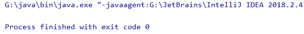

# 打印流

`PrintStream`是一个有关于打印流的类，我们一直使用的`System.out`其中的`out`就是一个`PrintStream`对象，下面是其在`System`类中的定义

```java
public final static PrintStream out = null;
```

打印流有以下的特点

- 它只负责数据的输出
- 永不抛出`IOExecption`
- 它继承了`OutputStream`类
- 它有自己的特有方法，如`print(), println()`，这两个方法可以打印出任意的数据类型
- 当它调用`OutputStream`类的方法`write()`时，打印数据时会查编码表，如`write(97)`会打印出`a`，但是`print(),println()`方法输入什么，打印出什么，如`print(97)`打印出`97`。

下面简单介绍使用，首先看`PrintStream`的构造方法

- `PrintStream(File file)`
- `PrintStream(OutputStream out)`
- `PrintStream(String filename)`

```java
PrintStream printStream = new PrintStream("a.txt");
printStream.write(97);
printStream.println(97);
printStream.println(22.2);
printStream.println(true);
printStream.println('a');
printStream.println("abc");
printStream.close();
```

打开`a.txt`文件，里面的内容为

```java
a97
22.2
true
a
abc
```

`System`类有一个方法`setOut(PrintStream out)`，可以用来改变`System.out`的指向，这样打印出的内容不会在控制台显示，而是会在文件中

```java
PrintStream printStream = new PrintStream("a.txt");
System.setOut(printStream);
System.out.println("怎么了，你累了，说好的幸福呢？");
```

运行程序发现控制台没有任何的输出



而在`a.txt`中出现了打印的语句。