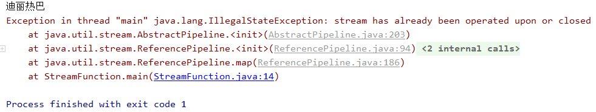

# Stream流

`Stream`流是`Java 8`引入的新特性，首先它跟`I/O`流没有任何的关系，它主要是用来处理集合、数组问题的。要看`Stream`流有什么用处，还是要看集合处理有什么缺点。

## 问题引出

有下面这么一个数组

```java
String[] strings = {"张无忌", "张三丰", "赵敏", "张翠山", "小昭", "张良"};
```

现在我们有如下要求

- 筛选出以"张"字开头的字符串，放入一个`Arraylist`集合中
- 在`ArrayList`集合中筛选出字符串长度为`3`的字符串，放入一个新的集合

```java
ArrayList<String> list1 = new ArrayList<>();
for (String string : strings) {
    if (string.startsWith("张")) {
        list1.add(string);
    }
}
System.out.println(list1);
ArrayList<String> list2 = new ArrayList<>();
for (String string : list1) {
    if (string.length() == 3) {
        list2.add(string);
    }
}
System.out.println(list2);
```

输出为

```java
[张无忌, 张三丰, 张翠山, 张良]
[张无忌, 张三丰, 张翠山]
```

现在我们使用`Stream`流的方式实现

```java
Stream<String> stream = Stream.of(strings);
stream.filter(str -> str.startsWith("张"))
        .filter(str -> str.length() == 3)
        .forEach(str -> System.out.print(str + " "));
```

输出为

```java
张无忌 张三丰 张翠山 
```

我们发现使用`Stream`流的代码比遍历集合简单很多，因为使用集合直接遍历真正核心的代码就那么一两句，比如

```java
for (String string : strings) {
    if (string.startsWith("张")) {
        list1.add(string);
    }
}
```

这些代码中核心的就是`string.startsWith("张")`，而其他的代码是为了达到这个目的不得不写的代码。这就是集合相较于`Stream`流的局限性所在，观察`Stream`流的写法，根本没有什么遍历集合的代码，直接就是你想要干的事情。

## 获取Stream流的方法

获取`Stream`流有两种方法

- `Collection`中新加的`stream()`方法，该方法可以得到一个`Stream`流，对于`Map`集合，可以通过`keySet(),values(),entrySet()`等方法得到`Set`集合，然后通过`Set`对象调用`stream()`方法得到`Stream`流
- `Stream`流的静态方法`of()`，该方法接收一个可变参数，所以可以传入一个数组

下面做一个演示

```java
import java.util.*;
import java.util.stream.Stream;

public class getStream {
    public static void main(String[] args) {
        ArrayList<String> list = new ArrayList<>();
        list.add("迪丽热巴");
        list.add("古力娜扎");
        list.add("哪吒");
        list.add("杨戬");
        Stream stream1 = list.stream();
        stream1.forEach(s -> System.out.println(s));

        HashMap<String,String> map = new HashMap<>();
        map.put("迪丽热巴","女");
        map.put("古力娜扎","女");
        map.put("哪吒","男");
        map.put("杨戬","男");
        Set<String> key = map.keySet();
        Stream stream2 = key.stream();
        stream2.forEach(s -> System.out.println(s));

        Collection<String> vals = map.values();
        Stream stream3 = vals.stream();
        stream3.forEach(s -> System.out.println(s));

        Set<Map.Entry<String,String>> entries = map.entrySet();
        Stream stream4 = entries.stream();
        stream4.forEach(s -> System.out.println(s));

        String[] strings = {"迪丽热巴", "古力娜扎", "哪吒", "杨戬"};
        Stream stream5 = Stream.of(strings);
        stream5.forEach(s -> System.out.println(s));
        
        Stream<Integer> stream6 = Stream.of(1,2,3,4,5);
        stream6.forEach(s -> System.out.println(s));
    }
}
```

## Stream中的常见方法

`Stream`流中的方法分为两类，一类叫做延迟方法，该方法返回的还是一个`Stream`流对象，所以可以进行链式编程，如`filter()`；另一类叫做终结方法，该方法不返回`Stream`流对象，如`forEach()， count()`(终结方法只有这两个，其他的都是延迟方法)。

### filter()

该方法需要传入的是一个`Predicate<T>`接口，这个接口我们在常用函数式接口讲过，它是对某中数据进行测试，而`filter`的作用就是如果`test(T t)`返回的是`true`，那么就将这个数据加入到新的流中，遍历完流中所有的元素后返回。

```java
//当字符串以迪开头时返回true，加入到新的流中，这个会被返回
Stream<String> stream1 = stream.filter(s -> s.startsWith("迪"));
//forEach是后面要介绍的方法，这里只需要理解为遍历流并打印
stream1.forEach(s -> System.out.println(s));
```

输出为

```java
迪丽热巴
```

### map()

该方法传入的是一个`Function<T,R>`接口，所以它的作用是将一个类型的转转化为另一个类型的流。如下

```java
//得到一个流，这个流是字符串的长度
Stream<Integer> stream2 = stream.map(s -> s.length());
stream2.forEach(s -> System.out.println(s));
```

这时结果报错了



这是因为这个`stream`在调用上面的`filter()`的时候已经使用过了，而流使用了一次就会关闭，不能在使用，这就是为什么会报错的原因，所以我们把代码改为

```java
//得到一个流，这个流是字符串的长度
Stream<Integer> stream2 = Stream.of(strings).map(s -> s.length());
stream2.forEach(s -> System.out.println(s));
```

这时输出为

```java
4
4
2
2
```

### forEach

该方法传入的是一个`Consumer<T>`接口，是一个终结方法，该方法会遍历流中的元素，然后使用`Consumer`接口中的`accept()`方法对元素进行处理，比如

```java
stream.forEach(s -> System.out.println(s));
```

会逐个打印出流中的元素。

### limit

`limit`方法需要传入一个`long`类型的数值`maxSize`，该方法会截取流中的前`maxSize`个元素放到新流中并返回，如

```java
//这是链式编程
Stream.of(strings).limit(2).forEach(s -> System.out.println(s));
```

输出为

```java
迪丽热巴
古力娜扎
```

### skip

该方法接收一个`long`类型的数据`n`，它会跳过流中的前`n`个元素，将剩下的元素放入到一个新流中并返回，如

```java
Stream.of(strings).skip(2).forEach(s -> System.out.println(s));
```

输出为

```java
哪吒
杨戬
```

### count

该方法不需要传入参数，返回一个`long`类型的整数，该整数是流中元素的个数，这个方法是一个终结方法，不返回`Stream`流

```java
long num = Stream.of(strings).count();
System.out.println(num);
```

输出为

```java
4
```

