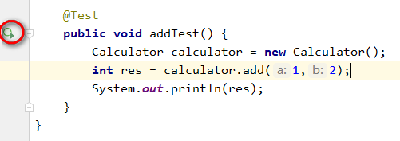
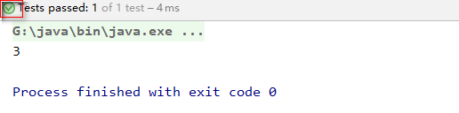
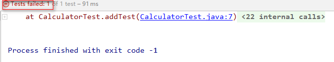
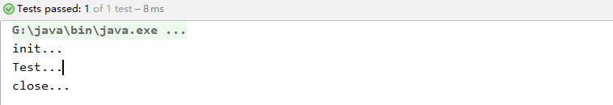
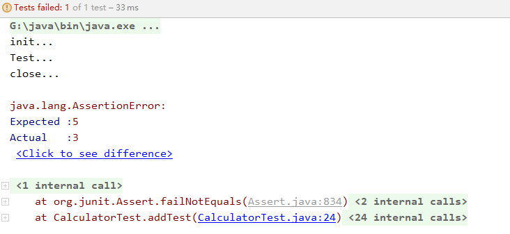

# Junit测试

测试分为两种，一种叫做黑盒测试，一种叫做白盒测试。所谓黑盒测试指的是把程序看做是一个黑盒子，程序内部对我们来说是不可见的，我们关注的是对于我们的输入，能否得到一个正确正确的结果。而白盒测试是管局具体的执行流程的，比如有时候我们需要测试哪一步消耗的性能多，这就不是给定输入看输出是否正确了，我们需要跟踪程序的执行流程，以观察哪里需要改进。

我们来看一个测试的例子，假设有这么一个类

```java
public class Calculator {
    public int add(int a, int b) {
        return a + b;
    }
    
    public int subtract(int a, int b) {
        return a - b;
    }
    
    public int mul(int a, int b) {
        return a * b;
    }
    
    public int divide(int a, int b) {
        return a / b;
    }
}
```

那现在我要测试一下这个类中的方法是否能够实现我想要的功能，新建一个测试类，一般测试类的类名为`要测试的类名+Test`，所以新建类`CalculatorTest`，先测试`add`方法

```java
public class CalculatorTest {
    public static void main(String[] args) {
        Calculator calculator = new Calculator();
        int res = calculator.add(1,2);
        System.out.println(res);
    }
}
```

输出为

```java
3
```

现在测试`subtract`方法，以防`add`方法的输出影响，我们将上面的代码注释

```java
public class CalculatorTest {
    public static void main(String[] args) {
        Calculator calculator = new Calculator();
//        int res = calculator.add(1,2);
//        System.out.println(res);
        int res = calculator.subtract(2,1);
        System.out.println(res);
    }
}
```

输出为

```java
1
```

那么我们就要说一下这样的问题

- 现在简单的测试的输出结果还可以看出来是正确的，但是复杂一点的输出我们根本判断不了，所以打印出结果来判断是否成功不可取
- 为了要测试一个新的方法，我都要把上面的测试代码注释掉，以防影响我下面的输出，这样十分的麻烦

这里就要用到我所说的`Junit`测试了，`Junit`测试是白盒测试(也就是说需要写代码)，我们一般是通过看执行十分成功来看功能是否达到要求，使用`@Test`注解方法，可以直接执行该方法，不用写在`main`方法中，所以我们每次测试一个方法不要注释上面的代码，现在我们将`CalculatorTest`改为

```java
import org.junit.Test;

public class CalculatorTest {

    @Test
    public void addTest() {
        Calculator calculator = new Calculator();
        int res = calculator.add(1,2);
        System.out.println(res);
    }
}
```



注意到左边的绿色符号，代表这个方法是可以被执行，一般我们将方法名写为`要测试的方法名+Test`。我们判断这次测试是否成功是看执行结果为"绿色"



为绿色就代表成功，现在我们在这个方法中加入一个异常



发现是测试失败，输出结果`3`单这个数字我们判断不了是成功还是失败(当然这个简单的例子可以看出，但是复杂一点呢?)，我们应该在程序加入断言

```java
import org.junit.Assert;
import org.junit.Test;

public class CalculatorTest {

    @Test
    public void addTest() {
        Calculator calculator = new Calculator();
        int res = calculator.add(1,2);
        //3代表是应该输出的值，res是真正的值
        //如果不相等就会抛出异常，测试失败
        Assert.assertEquals(3,res);
    }
}
```

这样我们应该看到的是输出是否为"绿色"来判断是否成功，而不是看输出结果是否成功。因为前面那一件事情我们比较容易可以办到。


下面还要介绍两个注解

- `Before`
  - 被`Before`注释的方法，是会在`Test`方法执行之前执行
  - 一般用于进行初始化，省去重复的代码
- `After`
  - 在`Test`方法执行之后执行
  - 一般用于释放资源，即使`Test`方法抛出异常，该方法还是会执行

```java
import org.junit.After;
import org.junit.Assert;
import org.junit.Before;
import org.junit.Test;

public class CalculatorTest {

    @Before
    public void init() {
        System.out.println("init...");
    }
    @After
    public void close() {
        System.out.println("close...");
    }

    @Test
    public void addTest() {
        System.out.println("Test...");
        Calculator calculator = new Calculator();
        int res = calculator.add(1,2);
        //3代表是应该输出的值，res是真正的值
        //如果不相等就会抛出异常，测试失败
        Assert.assertEquals(3,res);
    }
}
```



现在我们在`addTest`方法中制造一个异常，将断言的值改为`5`

```java
import org.junit.After;
        import org.junit.Assert;
        import org.junit.Before;
        import org.junit.Test;

public class CalculatorTest {

    @Before
    public void init() {
        System.out.println("init...");
    }
    @After
    public void close() {
        System.out.println("close...");
    }

    @Test
    public void addTest() {
        System.out.println("Test...");
        Calculator calculator = new Calculator();
        int res = calculator.add(1,2);
        //3代表是应该输出的值，res是真正的值
        //如果不相等就会抛出异常，测试失败
        Assert.assertEquals(5,res);
    }
}
```



测试失败了，但是`close()`方法还是执行了。